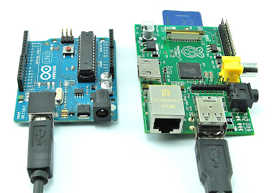

# usb serial port handling

a brief explanation of USB port handling for serial communication while using amicrocontrollers. 

- [read about the usb port's serial communication](#usb-devices-identification)
- [move directly to scripts](#ready-to-use-script)



### USB devices identification 
when we connect a USB device to your PC, the OS creates a `virtual serial port` as an Interface for this connection which we usually use to communicate with `microcontrollers`(e.g. arudino compatible MCUs).
on Ubuntu, you can see this ports using the command ``` ls /dev/tty* ``` and the output will look something like `ttyACM0` or `ttyUSB0`. 

### ttyACM and ttyUSB
While there aren’t any practical differences between these two ports in most use cases, they may indicate different types of embedded connections. When a USB device connects to a debian based linux, it appears as either /dev/ttyUSB or /dev/ttyACM, depending on how it communicates. Devices using a `USB-to-serial converter (like FTDI or CH340)` show up as `/dev/ttyUSB` because they convert UART to USB. On the other hand, `microcontrollers` that support USB directly, often pretend to be using the CDC-ACM protocol(which is a cross-platform standarad communication class used eariler; mainly for modems), so they appear as `/dev/ttyACM` .

### Hardware Properties of a USB-Serial Connection
When you plug in a USB device (like an Arduino), the system reads and stores certain `hardware descriptors` that identify the device. These descriptors come from the `device’s firmware` and include things like `Vendor ID`, `Product ID` and `Serial number` letting us distinguis them from other devices(even identical!). if a device has opened a port like `ttyACM0`, use the command ```udevadm info -a -n /dev/ttyACM0``` to list the full properties(we will filter the output when writing rules). 

### device name assignment
It’s really important to understand how Linux assigns device names like `ttyACM0` or `ttyACM1`, especially during `boot` when multiple USB devices are connected.The Linux kernel detects USB devices in the order they are initialized, meaning if you have one device connected, it will typically be assigned `ttyACM0`. If you plug in another device afterward, it will usually become `ttyACM1`. This naming is not based on physical port location, in other words, there is no built-in priority for USB ports.This process is handled by `udev`, the `Linux subsystem` responsible for device management (usaully handles devices under the `/dev` directory). Everything works fine, until we face a specific issue: `booting your system with multiple USB devices already connected`. In this case, we can't reliably predict which device will be initialized first, and therefore, which one will be assigned to `ttyACM0` or `ttyACM1`.Even though we can identify devices manually using tools like `udevadm`, this creates a problem for automated scripts or programs. If we’re trying to send data to a specific device, we can’t be sure which `/dev/ttyACM*` name it will be given after boot. This unpredictability can break automation unless we apply a more stable identification system.

### udev rules
We previously mentioned the issue with the unreliability of the default udev naming system, where the device names like `ttyACM0` or `ttyACM1` can change on each reboot depending on the order in which devices are initialized. Fortunately, Linux provides a solution to this problem through `udev rules`. By writing custom udev rules, we can create `virtual ports` with our desired names and link them to specific devices based on `defined conditions`.
This means we can specify criteria such as `device IDs (Vendor ID, Product ID, Serial Number)` to identify the exact device we want to target. For example, we can create a rule file that contains the IDs of the device we want to automate the connection to, and then link those to a virtual port (e.g., `/dev/my_arduino_port`). Even if the system assigns `ttyACM0` or `ttyACM1` to different devices after a reboot, our virtual port will still be assigned to the correct device based on the hardware IDs or other defined criteria.
This ensures that our system will always recognize the devices consistently, regardless of how the USB ports are initialized. By doing this, we eliminate the unpredictability of default naming and can maintain stable and reliable device communication.

steps to define a `udev rule`:

1. first plug in your microcontroller, preferably when no other devices are connected and in terminal, enter the command ``` ls /dev/ttyACM* ``` or ``` ls /dev/ttyUSB* ``` to find the full name. lets consider it `ttyACM0`
2. enter the command ``` udevadm info -a -n /dev/ttyACM0 | grep -E 'idVendor|idProduct|serial' ``` and the output will look like : 
```bash
 ID_VENDOR_ID=2f2f
 ID_MODEL_ID=2424
 ID_SERIAL_SHORT=165ADCFB50304A46462E312FF
```
3. copy the values of the first two(if two indentical devices are connected, you will need the serial ID aswell)
4. enter ```sudo vim /dev/udev/rules.d/99-micro.rules``` and replace `micro` with any name you want. you can use `nano` instead of `vim`
5. paste the following content with respect to vendor ID and product ID:
 
```bash
SUBSYSTEM=="tty", ATTRS{idVendor}=="2f2f", ATTRS{idProduct}=="2424", SYMLINK+="ttyMicro"
```
> remember you can use any name you want for `SYMLINK`. its suggested to start the name with tty

6. save the file and use these commands: 
```bash
sudo udevadm control --reload-rules
sudo udevadm trigger
```
7. use ``` ls -l /dev/ttyMicro ``` to check if the port is made. it must show what device it has been linked to.
> in the output, you should see something like : /dev/ttyMicro -> ttyACM0

8. you've successfully made a symlink to a USB port!  

# ready-to-use script
on Ubuntu:

1. ``` git clone https://github.com/AmirrezaRamesh/usb-serial-port-handling ```
2. ``` cd ./scripts ```
3. ```./udev_rule_maker <port_name> <port_symlink_name>``` \
> **note:** `<port_name>` is the actual USB port(e.g. ttyACM0) and `<port_symlink_name>` is the link to the port with any desired name(e.g. ttyMyMicro)

the script is shown below. you can take a look at it before running : 

```bash
#!/bin/bash

# bash script to make a udev rule for a USB serial device
# usage: ./setup_udev_rule.sh <arg1> <arg2>
# <arg1> is the port we want to make a link to (e.g ttyACM0)
# <arg2> is the virtual port that is linked to an actual link(e.g. ttyMyMicro)

# AI assistance was used to write a few of below lines

PORT_NAME=$1``
SYMLINK_NAME=$2

# receving the arguments
if [[ -z "$PORT_NAME" || -z "$SYMLINK_NAME" ]]; then
    echo "Usage: $0 <device_port> <custom_name>"
    echo "example: $0 ttyACM0 myArduino"
    exit 1
fi

DEVICE_PATH="/dev/$PORT_NAME"

#check for device
if [ ! -e "$DEVICE_PATH" ]; then
    echo "Device $DEVICE_PATH not found"
    exit 1
fi

#not necessary but I put it anyways
#echo "Setting permissions on $DEVICE_PATH..."
sudo chmod 666 "$DEVICE_PATH"
#echo "Done."

echo "getting device info for $DEVICE_PATH..."

# extract vendor id, product id, serial ID
# serial is used when two identical devices are connected. if so, uncomment line 50 and modify line 57
udev_info=$(udevadm info --query=all --name="$DEVICE_PATH")
VENDOR_ID=$(echo "$udev_info" | grep -m1 "ID_VENDOR_ID" | cut -d= -f2)
MODEL_ID=$(echo "$udev_info" | grep -m1 "ID_MODEL_ID" | cut -d= -f2)
SERIAL=$(echo "$udev_info" | grep -m1 "ID_SERIAL_SHORT" | cut -d= -f2)

if [[ -z "$VENDOR_ID" || -z "$MODEL_ID" ]]; then
    echo "couldn't extract USB IDs... is this a proper USB serial device?"
    exit 1
fi

echo "vendor: $VENDOR_ID"
echo "product: $MODEL_ID"
# I commented the line since there were sometimes I couldn't read serial number for some reason
# echo "serial: $SERIAL" 

# write rule file
RULE_FILE="/etc/udev/rules.d/99-${SYMLINK_NAME}.rules"
echo "writing rule to $RULE_FILE..."

sudo bash -c "cat > $RULE_FILE" <<EOF
SUBSYSTEM=="tty", ATTRS{idVendor}=="$VENDOR_ID", ATTRS{idProduct}=="$MODEL_ID", SYMLINK+="tty$SYMLINK_NAME"
EOF

# reload and apply
echo "reloading udev rules..."
sudo udevadm control --reload-rules
sudo udevadm trigger

# small delay to give udev time
sleep 2

# check if symlink was created
if [ -e "/dev/tty$SYMLINK_NAME" ]; then
    echo "Succsess! symlink created: /dev/tty$SYMLINK_NAME -> $PORT_NAME"
    ls -l "/dev/tty$SYMLINK_NAME"
else
    echo "symlink not created. check the rule or device info again"
fi

# optional basic check - just to make sure device is alive
# echo "checking access to /dev/tty$SYMLINK_NAME..."
# if stat "/dev/tty$SYMLINK_NAME" > /dev/null 2>&1; then
#     echo "device is accessible"
# else
#     echo "device not accessible - maybe permissions?"
# fi

```
