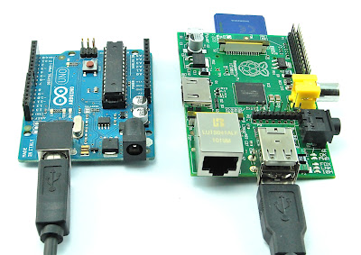

# usb serial port handling

This project helps you manage **USB serial devices on Linux (Ubuntu)** by creating stable device names using **udev rules**.

Instead of relying on changing names like `/dev/ttyACM0`, we generate a **persistent alias** like `/dev/ttyMyRobot`, which always points to the correct device.

---

## Quick navigation

- [USB device basics](#usb-devices-identification)
- [ttyACM vs ttyUSB](#ttyacm-and-ttyusb)
- [Why device names change](#device-name-assignment)
- [Fixing the problem with udev rules](#udev-rules)
- [Ready-to-use script](#ready-to-use-script)

---



---

# USB devices identification

When you plug a USB device into your PC, Linux creates a **virtual serial interface** under `/dev/`.

This is what allows communication with microcontrollers like:
- Arduino
- STM32 boards
- ESP32 (USB-serial mode)

You can list available ports with:

```bash
ls /dev/tty*
```

Common results:
- `ttyACM0`
- `ttyUSB0`

---

# ttyACM and ttyUSB

Both are serial interfaces, but they come from different USB implementations.

## `/dev/ttyUSB*`
Used when a device relies on a **USB-to-serial converter chip**, such as:
- FTDI
- CH340
- CP2102

In this case, USB is converted into UART internally.

---

## `/dev/ttyACM*`
Used when a microcontroller supports **native USB communication**, usually through:

- CDC-ACM protocol
- Arduino Uno R3, Leonardo
- STM32 USB mode

It behaves like a virtual modem-style serial device.

---

# Device hardware identification

Every USB device exposes metadata:

- Vendor ID
- Product ID
- Serial Number

To inspect a device:

```bash
udevadm info -a -n /dev/ttyACM0
```

Or filtered:

```bash
udevadm info -a -n /dev/ttyACM0 | grep -E 'idVendor|idProduct|serial'
```

Example output:

```bash
ID_VENDOR_ID=2f2f
ID_MODEL_ID=2424
ID_SERIAL_SHORT=165ADCFB50304A46462E312FF
```

---

# Device name assignment

Linux assigns device names like `/dev/ttyACM0`, `/dev/ttyACM1`, etc. based on connection order, not physical USB port.

This means:
- first device → ttyACM0
- second device → ttyACM1

But this changes depending on:
- reboot order
- plug timing
- multiple devices connected at boot

This is handled by **udev**, the Linux device manager.

---

## The problem

If multiple devices are connected at boot:
- naming becomes unpredictable
- automation scripts may break
- ROS nodes may fail silently

---

# udev rules

udev rules solve this by creating **stable symbolic links**.

Instead of relying on:
```
/dev/ttyACM0
```

We create:
```
/dev/ttyMyRobot → /dev/ttyACM0
```

This mapping is based on:
- Vendor ID
- Product ID
- (optional) Serial Number

So the name stays stable even after reboot.

---

## Example workflow

### 1. Find device

```bash
ls /dev/ttyACM*
```

Assume:
```
ttyACM0
```

---

### 2. Extract IDs

```bash
udevadm info -a -n /dev/ttyACM0 | grep -E 'idVendor|idProduct|serial'
```

Example:

```bash
ID_VENDOR_ID=2f2f
ID_MODEL_ID=2424
ID_SERIAL_SHORT=165ADCFB50304A46462E312FF
```

---

### 3. Create rule file

```bash
sudo nano /etc/udev/rules.d/99-micro.rules
```

---

### 4. Add rule

```bash
SUBSYSTEM=="tty", ATTRS{idVendor}=="2f2f", ATTRS{idProduct}=="2424", SYMLINK+="ttyMicro"
```

---

### 5. Reload rules

```bash
sudo udevadm control --reload-rules
sudo udevadm trigger
```

---

### 6. Verify

```bash
ls -l /dev/ttyMicro
```

Expected:

```
/dev/ttyMicro → ttyACM0
```

---

# Ready-to-use script

This repository includes a script that automates everything above.

---

## Install

```bash
git clone https://github.com/AmirrezaRamesh/usb-serial-port-handling
cd scripts
```

---

## Usage

```bash
./udev_rule_maker <port_name> <symlink_name> [--serial]
```

### Arguments:
- `port_name` → actual device (e.g. ttyACM0)
- `symlink_name` → custom name (e.g. myRobot)
- `--serial` → optional (more precise, useful for identical devices)

---

## Example

```bash
./udev_rule_maker ttyACM0 myRobot --serial
```

Creates:
```
/dev/ttyMyRobot → ttyACM0
```

---

## What the script does

- validates inputs
- checks device existence
- extracts USB identifiers
- optionally uses serial number
- prevents rule overwrite
- reloads udev automatically
- verifies creation

---

## Script (reference)

```bash
#!/bin/bash

# bash script to make a udev rule for a USB serial device
# usage: ./setup_udev_rule.sh <arg1> <arg2>
# <arg1> is the port we want to make a link to (e.g ttyACM0)
# <arg2> is the virtual port that is linked to an actual link(e.g. ttyMyMicro)

# AI assistance was used to write a few of below lines

set -e

PORT_NAME=$1
SYMLINK_NAME=$2
USE_SERIAL=$3   # optional: "--serial"

# receving the arguments
if [[ -z "$PORT_NAME" || -z "$SYMLINK_NAME" ]]; then
    echo "Usage: $0 <device_port> <custom_name> [--serial]"
    echo "example: $0 ttyACM0 myArduino"
    exit 1
fi

DEVICE_PATH="/dev/$PORT_NAME"

# check for device
if [ ! -e "$DEVICE_PATH" ]; then
    echo "Device $DEVICE_PATH not found"
    exit 1
fi

# sanity check for symlink name (avoid weird udev rule names)
if [[ ! "$SYMLINK_NAME" =~ ^[a-zA-Z0-9_-]+$ ]]; then
    echo "Invalid symlink name. Use only letters, numbers, _ or -"
    exit 1
fi

echo "Target device: $DEVICE_PATH"

# optional permission fix (not always recommended, but kept as-is)
sudo chmod 666 "$DEVICE_PATH" || true

echo "getting device info for $DEVICE_PATH..."

udev_info=$(udevadm info --query=all --name="$DEVICE_PATH")

get_value() {
    echo "$udev_info" | grep -m1 "$1" | cut -d= -f2 || true
}

VENDOR_ID=$(get_value "ID_VENDOR_ID")
MODEL_ID=$(get_value "ID_MODEL_ID")
SERIAL=$(get_value "ID_SERIAL_SHORT")

if [[ -z "$VENDOR_ID" || -z "$MODEL_ID" ]]; then
    echo "couldn't extract USB IDs... is this a proper USB serial device?"
    exit 1
fi

echo "vendor:  $VENDOR_ID"
echo "product: $MODEL_ID"

if [[ "$USE_SERIAL" == "--serial" && -n "$SERIAL" ]]; then
    echo "serial:  $SERIAL"
fi

RULE_FILE="/etc/udev/rules.d/99-${SYMLINK_NAME}.rules"

# prevent accidental overwrite
if [[ -f "$RULE_FILE" ]]; then
    echo "rule already exists: $RULE_FILE"
    read -p "overwrite it? [y/N]: " ans
    if [[ "$ans" != "y" ]]; then
        echo "aborted"
        exit 0
    fi
fi

echo "writing rule to $RULE_FILE..."

if [[ "$USE_SERIAL" == "--serial" && -n "$SERIAL" ]]; then
    RULE_CONTENT="SUBSYSTEM==\"tty\", ATTRS{idVendor}==\"$VENDOR_ID\", ATTRS{idProduct}==\"$MODEL_ID\", ATTRS{serial}==\"$SERIAL\", SYMLINK+=\"tty$SYMLINK_NAME\""
else
    RULE_CONTENT="SUBSYSTEM==\"tty\", ATTRS{idVendor}==\"$VENDOR_ID\", ATTRS{idProduct}==\"$MODEL_ID\", SYMLINK+=\"tty$SYMLINK_NAME\""
fi

echo "$RULE_CONTENT" | sudo tee "$RULE_FILE" > /dev/null

echo "reloading udev rules..."
sudo udevadm control --reload-rules
sudo udevadm trigger

sleep 1

LINK="/dev/tty$SYMLINK_NAME"

if [ -e "$LINK" ]; then
    echo "Success! symlink created: $LINK -> $PORT_NAME"
    ls -l "$LINK"
else
    echo "symlink not created. check rule or device info"
    echo "debug: try -> udevadm test $(udevadm info -q path -n $DEVICE_PATH)"
fi
```

---

# TODO / future improvements

- add remove-rule command
- list all managed devices
- device health check (responsive test)
- ROS2 integration (/dev/robot_* auto mapping)
- CLI tool version (udev-tool style)
```